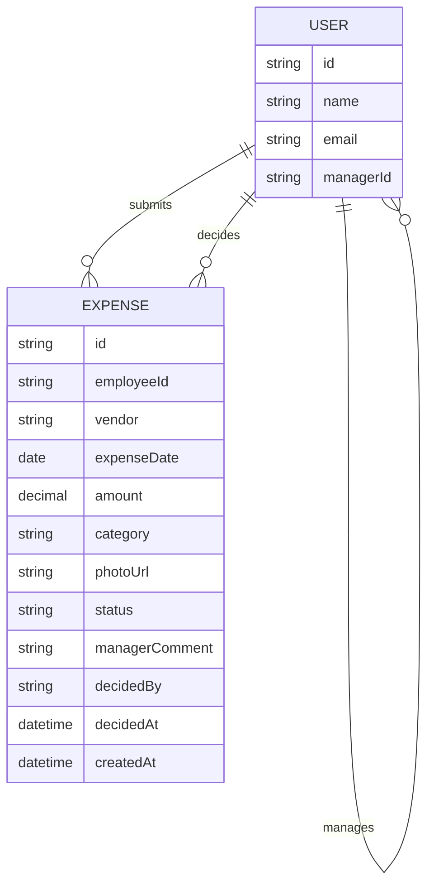

# Domain Model

The system tracks users (who may be an employee, a manager, or both) and the
expenses each employee submits for their manager to decide on.

- **USER** is a single directory entry: the `managerId` self-relation is what
lets one person be both an Employee (their own expenses) and a Manager
(their reports' expenses).
- **EXPENSE** belongs to exactly one employee (`employeeId`) and, once
decided, records which manager decided it (`decidedBy`) and their optional
`managerComment`. `status` is one of `pending`, `approved`, `rejected`.
`category` is one of the fixed category list (Travel, Meals, Lodging,
Office Supplies, Software, Other). `photoUrl` points at the stored receipt
image.

