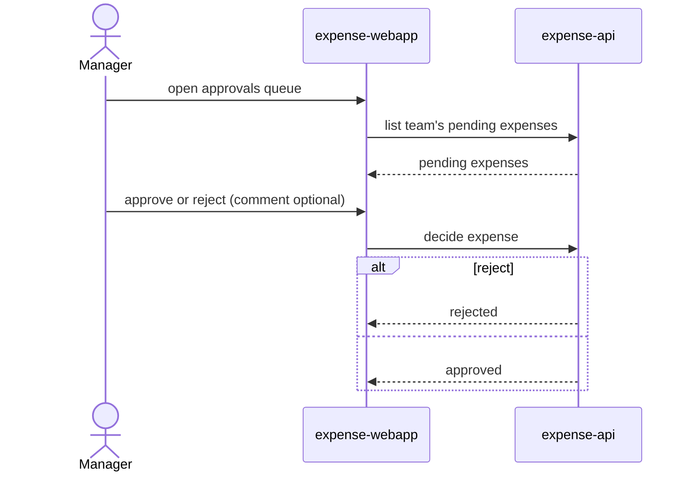

# Review and decide an expense

A Manager reviews the expenses awaiting their decision and approves or
rejects each one, with an optional comment; the employee then sees the
outcome.

```mermaid
sequenceDiagram
    actor Manager
    participant expense-webapp
    participant expense-api

    Manager->>expense-webapp: open approvals queue
    expense-webapp->>expense-api: list team's pending expenses
    expense-api-->>expense-webapp: pending expenses
    Manager->>expense-webapp: approve or reject (comment optional)
    expense-webapp->>expense-api: decide expense
    alt reject
        expense-api-->>expense-webapp: rejected
    else
        expense-api-->>expense-webapp: approved
    end
```

