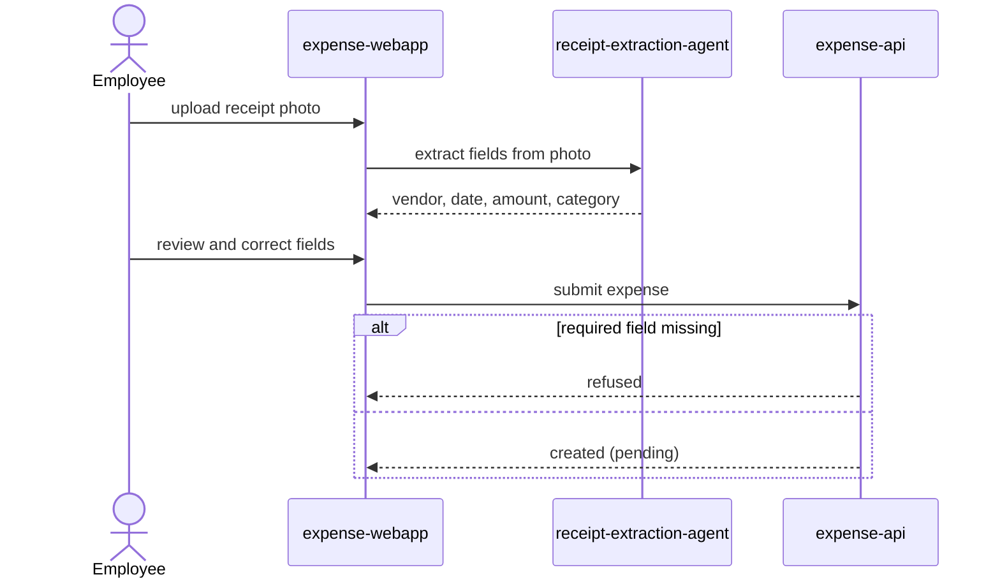

# Submit an expense

An Employee photographs a receipt, the agent reads it, and the employee
reviews and confirms the extracted details before the expense is submitted
for their manager's decision.

